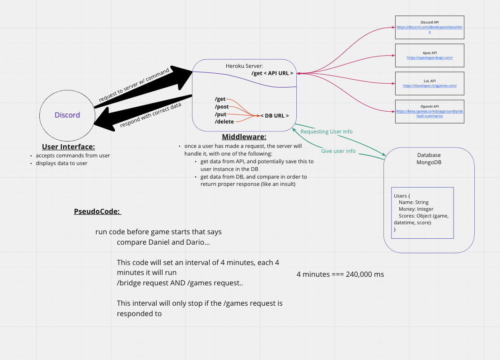

# [diss-bot](https://diss-bot.github.io/d-b-md/)
> Code Fellows 401

# Wireframe

## User Stories:
 - **User 1**: 
  - User Story: 
  - Featured Task: 
  - Acceptance Test: 

 - **User 2**: 
  - User Story: 
  - Featured Task: 
  - Acceptance Test: 

 - **User 3**: 
  - User Story: 
  - Featured Task: 
  - Acceptance Test: 

 - **User 4**: 
  - User Story: 
  - Featured Task: 
  - Acceptance Test: 

## [Software Requirements](requirements.md)

## Domain Modeling

## Database Schema Diagram