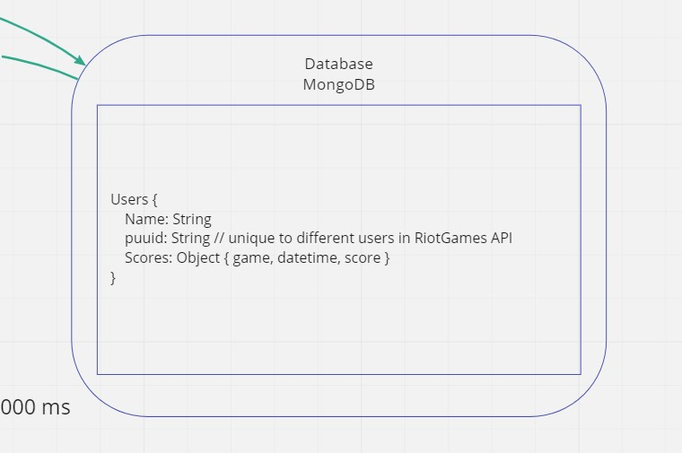

# [diss-bot](https://diss-bot.github.io/d-b-md/)
> Code Fellows 401

## User Stories:
 - **User 1**: 
  - User Story: As a user of diss-bot, I would like to access data from previous games me and my friends have played, and store it in a database.
  - Featured Task: Reach out to game APIs (like RiotGames API), and get the latest data. Take this data and store it in the database for each individual user.
  - Acceptance Test: Allow any user within the Discord server that diss-bot is operating, to track their stats across various games, and save those stats to the DB. 

 - **User 2**: 
  - User Story: As a user of diss-bot, I would like the app to let my teammates know when they are playing at a subpar level in a negative connotation.
  - Featured Task: The app will track player score and respond according to their preformance.
  - Acceptance Test: If a player isn't doing a good job, the app will tell them that they should uninstall the game and that their time should be spent elsewhere. For example: "You suck at this game, go read a book, maybe you'll learn something."

 - **User 3**: 
  - User Story: As a user of diss-bot, I would like a leaderboard of my freinds and I to see who is the best across various games.
  - Featured Task: Pull the past game data from the API and have the server parse the data to make a leaderboards.
  - Acceptance Test: On request, diss-bot with present a list from best to worst players for a certain game.

 - **User 4**: 
  - User Story: As a user of diss-bot, I would like to compare stats with my friends and roast them when I am doing better than expected
  - Featured Task: Return stats from recent games
  - Acceptance Test: Checking API and comparing/contrasting stats of two players that played in the same game, respond with the bot accordingly

## [Software Requirements](requirements.md)

## Domain Modeling

## Database Schema Diagram

